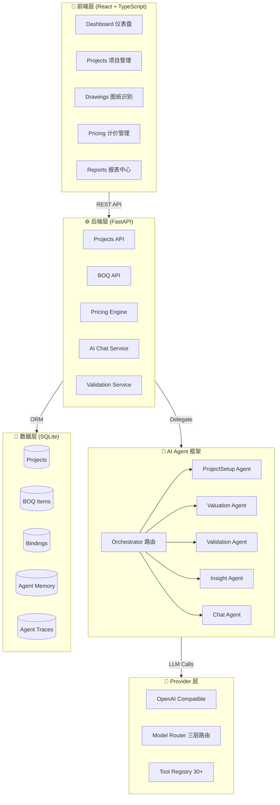

# 🏗️ 智慧建筑造价系统

[](LICENSE)
[](https://www.python.org/)
[](https://www.typescriptlang.org/)
[](https://fastapi.tiangolo.com/)
[](https://react.dev/)

> 🤖 **AI 驱动的建筑造价全流程管理平台**  
> 从图纸识别到清单生成、定额绑定、单价分析、成本核算的智能化闭环解决方案

## 📋 项目概览

| 模块 | 功能 | 技术栈 |
|------|------|--------|
| **前端** | React + TypeScript + Ant Design | Vite, TailwindCSS, Material Symbols |
| **后端** | FastAPI + SQLAlchemy | Python 3.12, SQLite, Pydantic |
| **AI** | 多 Agent 框架 | OpenAI Compatible, 三层模型路由, 自研 Agent Framework |
| **数据** | 结构化造价数据 | BOQ 清单、定额库、材料价格 |

## ✨ 核心特性

<table>
<tr>
<td width="50%">

### 📐 图纸 AI 识别

- 🎯 **智能识别**：上传结构平面图，AI 自动识别柱、梁、墙、板等构件
- 📊 **可视化标注**：边界框 + 置信度实时显示
- 🛠️ **手动调整**：修正/新增/删除/合并构件
- 📤 **一键导出**：识别结果直接生成 BOQ 清单

### � 计价管理

- 🔍 **单价分析**：人工/材料/机械费用完整分解
- 🔗 **定额绑定**：智能匹配 + 系数调整
- 💹 **实时价格**：市场价动态查询
- 📈 **可视化**：成本构成图表展示

### 📈 报表中心

- �📊 **项目总览**：造价汇总 + 进度追踪
- ✅ **绑定进度**：清单项绑定完成度
- ⚠️ **异常报告**：AI 审核问题汇总
- 📉 **历史对比**：成本趋势分析

</td>
<td width="50%">

### 📊 清单管理

- ✏️ **CRUD 操作**：项目级 BOQ 清单完整管理
- 📥 **批量导入**：支持 Excel 快速导入
- 🔗 **定额绑定**：清单项关联定额库
- 🤖 **AI 匹配**：智能推荐最佳定额

### 🤖 AI Agent 框架

- 🧠 **Orchestrator**：智能意图路由 + 多 Agent 编排
- � **12+ 专业 Agent**：估价、校验、分析、批量审核等
- �️ **30+ 工具**：定额搜索、绑定、计算、批量操作
- 🔌 **三层模型路由**：fast / balanced / powerful 自动选模型
- 💬 **上下文记忆**：跨会话 Memory + Skill 知识库
- ⚡ **性能优化**：批量工具调用、只读缓存、prompt 压缩

### ⭐ 企业定额库（Sprint 9）

- ✏️ **手工维护**：表单录入 + Excel 导入 + 标准模板下载
- 🤖 **智能沉淀**：扫描历史项目快照 + BOQ-定额绑定，加权聚合生成候选条目
- 📊 **置信度评分**：样本数 + 离散度 + 项目多样性三维度评估
- 🔄 **审批工作流**：`draft → in_review → approved/rejected → archived` 五态状态机
- ⭐ **AI 匹配优先**：已发布的企业定额在 BOQ 匹配时自动 +0.15 boost

### ⚙️ 系统配置

- 📐 **费率规则**：管理费、利润、税金配置
- 🔑 **AI 配置**：Provider、API Key、模型选择
- 💰 **价格库**：材料价格维护与更新
- 👥 **权限管理**：用户角色与访问控制

</td>
</tr>
</table>

## 🏗️ 技术架构



### 技术栈详情

| 层级 | 技术选型 | 说明 |
|------|---------|------|
| **前端框架** | React 18 + TypeScript | 类型安全的组件化开发 |
| **UI 库** | Ant Design + TailwindCSS | 企业级组件 + 原子化样式 |
| **状态管理** | React Hooks | 轻量级状态管理 |
| **构建工具** | Vite | 极速开发体验 |
| **后端框架** | FastAPI | 高性能异步 API |
| **ORM** | SQLAlchemy | 类型安全的数据库操作 |
| **数据库** | SQLite | 轻量级嵌入式数据库 |
| **AI 框架** | 自研 Agent Framework | BaseAgent + Orchestrator + Tool Registry |
| **API 文档** | OpenAPI (Swagger) | 自动生成交互式文档 |

## 📦 项目结构

```
building cost/
├── frontend/                    # React 前端
│   ├── src/
│   │   ├── pages/             # 页面组件 (10+)
│   │   ├── components/        # 通用组件 (15+)
│   │   ├── api.ts             # API 接口定义
│   │   └── index.css          # 全局样式
│   └── package.json
├── backend/                     # FastAPI 后端
│   ├── app/
│   │   ├── api/routes/        # API 路由 (15+ 模块)
│   │   ├── models/            # 数据模型 (10+)
│   │   ├── services/          # 业务逻辑
│   │   └── ai/
│   │       ├── agents/v2/     # Agent v2 (12+ Agents)
│   │       ├── framework/     # Agent Framework 核心
│   │       │   ├── base_agent.py       # 抽象基类 + 推理循环
│   │       │   ├── model_router.py     # 三层模型路由
│   │       │   ├── trace_collector.py   # 可观测性
│   │       │   ├── memory_store.py      # 跨会话记忆
│   │       │   └── streaming_executor.py# 流式工具执行
│   │       ├── providers/     # LLM Provider 适配
│   │       ├── tools/         # 工具定义 (30+)
│   │       ├── skills/        # 领域知识库
│   │       └── pipelines/     # 多 Agent 流水线
│   ├── tests/                 # 测试 (5,600+ 行)
│   └── requirements.txt
├── docs/design/                 # 架构设计文档
└── README.md
```

## 🚀 快速开始

### 📋 环境要求

| 工具 | 版本要求 | 说明 |
|------|---------|------|
| Python | 3.12+ | 后端运行环境 |
| Node.js | 18+ | 前端构建工具 |
| Git | 最新版 | 版本控制 |
| 操作系统 | macOS / Linux / Windows | 跨平台支持 |

### ⚡ 一键启动（推荐）

```bash
# 1. 克隆项目
git clone https://github.com/BruceLee1024/aicost.git
cd "building cost"

# 2. 启动后端（新终端）
cd backend
python -m venv venv
source venv/bin/activate  # Windows: venv\Scripts\activate
pip install -r requirements.txt
uvicorn app.main:app --reload --host 0.0.0.0 --port 8000

# 3. 启动前端（新终端）
cd frontend
npm install
npm run dev
```

### 🌐 访问应用

| 服务 | 地址 | 说明 |
|------|------|------|
| 🎨 **前端应用** | http://localhost:5173 | React 用户界面 |
| ⚙️ **后端 API** | http://localhost:8000 | FastAPI 服务 |
| 📚 **API 文档** | http://localhost:8000/docs | Swagger UI |
| 🔧 **ReDoc** | http://localhost:8000/redoc | 备用文档 |

### 🤖 配置 AI（可选）

1. 复制环境变量模板：
```bash
cp .env.example .env
```

2. 编辑 `.env` 文件：
```env
# OpenAI 配置
AI_PROVIDER=openai
AI_API_KEY=sk-your-api-key-here
AI_BASE_URL=https://api.openai.com/v1
AI_MODEL=gpt-4o

# 或使用兼容的本地模型
AI_PROVIDER=openai
AI_BASE_URL=http://localhost:11434/v1
AI_MODEL=qwen2.5:14b

# OPT-4: 三层模型路由（可选）
AI_MODEL_FAST=deepseek-chat          # Tier 1: 简单查询
# AI_MODEL 默认为 Tier 2: 标准分析
AI_MODEL_POWERFUL=deepseek-reasoner   # Tier 3: 复杂推理
```

3. 重启后端服务即可生效

## 📊 项目规模

### 代码统计

```
📦 总计约 60,000 行代码 (239 文件)
├── 🐍 Python (203 files)    35,126 行  (后端 + AI Agent 框架 + 测试)
├── 📘 TypeScript/TSX (36)   13,402 行  (前端组件 + API)
├── 🎨 CSS                    9,290 行  (样式系统)
├── 📖 Markdown               2,533 行  (文档 + Skills)
└── 🗄️ SQL                      121 行  (迁移脚本)
```

### 模块分布

| 模块 | 文件数 | 核心功能 |
|------|--------|----------|
| **后端 API** | 35+ | 路由 (15 模块)、服务、Schema |
| **前端页面** | 36 | Dashboard、项目、计价、图纸、知识图谱、AI 指挥中心 |
| **AI Agent v2** | 12+ | Orchestrator + 专业 Agent (估价/校验/分析/开项) |
| **Agent Framework** | 15+ | BaseAgent、ModelRouter、TraceCollector、ToolRegistry |
| **AI 工具** | 30+ | 定额搜索、绑定、计算、批量审核、报告生成 |
| **数据模型** | 10+ | SQLAlchemy ORM (含 Memory、Trace) |
| **测试** | 5,677 行 | Agent Framework 全覆盖 |

### 功能覆盖

- ✅ 10+ 主要页面（Dashboard、项目、计价、图纸、报表、知识图谱、AI 指挥中心等）
- ✅ 50+ REST API 端点
- ✅ 15+ 数据库表（含 Agent Memory、Trace）
- ✅ 12+ AI Agent（Orchestrator 智能路由）
- ✅ 30+ Agent 工具（含批量工具调用）
- ✅ 三层模型路由 (fast / balanced / powerful)
- ✅ 响应式设计（桌面 + 平板）

## 🧪 开发指南

### 添加新页面
1. 在 `frontend/src/pages/` 创建组件
2. 在 `App.tsx` 添加路由
3. 在 `NAV_ITEMS` 添加导航项
4. 编写 CSS 样式（遵循 `dr-` 前缀规范）

### API 开发
1. 在 `backend/app/models/` 定义数据模型
2. 在 `backend/app/api/routes/` 添加路由
3. 在 `backend/app/services/` 实现业务逻辑
4. 更新 `frontend/src/api.ts` 接口定义

### AI Agent 开发

1. **新建 Agent**：继承 `BaseAgent`，定义 `name`、`system_prompt`、`tool_names`
2. **新建工具**：用 `@tool_def` 装饰器注册到 ToolRegistry
3. **注册到 Orchestrator**：在 `orchestrator.py` 添加 delegate 路由
4. **模型路由**：在 `model_router.py` 的 `_AGENT_TIER_MAP` 配置 tier

```python
# 示例：创建新 Agent
class MyAgent(BaseAgent):
    name = "my_agent"
    description = "专业XX分析 Agent"
    system_prompt = "你是一位专业的..."
    tool_names = ["search_quotas", "calculate"]
```

## 📝 版本历史

<details open>
<summary><b>⭐ Sprint 9 (2026-05) - 企业定额沉淀工具</b></summary>

- ✅ **独立企业定额库**：新表 `enterprise_quota_items`，与公共定额并存，支持 5 态审批流（draft/in_review/approved/rejected/archived）
- ✅ **三种数据来源**：手工录入 + Excel 导入（带模板下载） + 历史项目智能沉淀
- ✅ **沉淀分析器**：`enterprise_quota_precipitation_service` 扫描所有 Snapshot + LineItemQuotaBinding，按 `(BOQ 编码前 9 位, 名称归一化, 单位)` 聚类生成 `EnterpriseQuotaCandidate` 候选条目
- ✅ **置信度评分**：`0.5×样本饱和度 + 0.3×低离散度 + 0.2×项目多样性`
- ✅ **匹配优先级**：`quota_match_service` 注入企业定额，已发布条目在 AI 匹配候选中自动 +0.15 boost 并标注 `⭐ 企业定额`
- ✅ **新页面 `/enterprise-quota`**：4 张统计卡 + 5 个 Tab（已发布/待审批/草稿/智能推荐/已驳回）+ 编辑弹窗 + 审批意见框 + 紫色候选卡片网格（带置信度环形进度）
- ✅ **17 个 REST 端点**：CRUD + 状态机（submit/approve/reject/archive/restore） + 导入 + 模板下载 + 候选 analyze/promote/dismiss
- ✅ **测试**：21 个 pytest 用例（CRUD、状态机、Excel 导入、沉淀算法、归一化、候选提升）全部通过
- 📦 新增文件：10 个后端 + 4 个前端

</details>

<details>
<summary><b>🤖 Sprint 8 (2026-04) - Agent Framework v2 全面升级</b></summary>

- ✅ **Agent v2 框架**：BaseAgent 抽象基类 + 统一推理循环，12+ 专业 Agent
- ✅ **Orchestrator**：智能意图路由，结构化 delegate 返回
- ✅ **批量工具调用** (OPT-1)：`batch_search_standard_codes` 单次调用多关键词
- ✅ **只读缓存** (OPT-2)：运行时缓存只读工具结果，破坏性操作自动失效
- ✅ **Prompt 精简** (OPT-3)：Orchestrator prompt 压缩 62%，降低 token 消耗
- ✅ **模型路由** (OPT-4)：三层 tier (fast/balanced/powerful) + 环境变量 override
- ✅ **Context Compaction**：微压缩 + 全压缩 + 快照重注入
- ✅ **Reflection**：无进展检测 + 强制 re-plan
- ✅ **可观测性**：TraceCollector 记录 cache hits、reasoning、compaction
- ✅ **Memory & Skills**：跨会话记忆 + 领域知识库
- ✅ **流式执行**：StreamingToolExecutor 并发工具执行
- ✅ **前端**：AI 指挥中心、知识图谱、Memory/Skills 面板
- 📦 代码量：+30,000 行（含测试 5,677 行）

</details>

<details>
<summary><b>🎯 Sprint 7 (2026-03) - 图纸识别与性能优化</b></summary>

- ✅ **图纸 AI 识别**：DrawingRecognition 页面，SVG 蓝图可视化
- ✅ **性能优化**：Dashboard 加载速度提升 5x（轻量级 API）
- ✅ **AI 统一**：全站 AI 助手接入真实后端（api.aiChat）
- ✅ **动态化**：UnitPriceAnalysis 替换所有 mock 数据
- 📦 代码量：+2,500 行

</details>

<details>
<summary><b>🤖 Sprint 6 (2025-02) - AI Agent 系统</b></summary>

- ✅ **智能估价**：AI Agent 自动定额匹配 + 绑定
- ✅ **工具调用**：7 个工具（search_quotas, bind_quota, calculate 等）
- ✅ **流式响应**：SSE 实时步骤展示
- ✅ **AgentPanel**：侧边栏 AI 交互组件
- 📦 代码量：+3,200 行

</details>

<details>
<summary><b>💰 Sprint 5 (2025-02) - 单价分析重构</b></summary>

- ✅ **页面重构**：UnitPriceAnalysis 完整改版
- ✅ **计算溯源**：费用分解可视化（人材机）
- ✅ **共享组件**：PageBreadcrumb 统一面包屑
- ✅ **详情优化**：ProjectDetail 数据流优化
- 📦 代码量：+1,800 行

</details>

<details>
<summary><b>📊 Sprint 4 (2025-01) - 计价管理</b></summary>

- ✅ **计价模块**：PricingManagement 完整实现
- ✅ **定额绑定**：BoqTab 绑定 UI + 批量操作
- ✅ **价格快照**：历史价格记录
- ✅ **批量操作**：多选 + 批量绑定/解绑
- 📦 代码量：+2,400 行

</details>

<details>
<summary><b>🗂️ Sprint 3 (2024-12) - 项目与清单</b></summary>

- ✅ **项目管理**：CRUD + 列表/详情页
- ✅ **BOQ 清单**：清单项管理 + 导入导出
- ✅ **数据验证**：前后端校验规则
- ✅ **Excel 支持**：批量导入清单
- 📦 代码量：+3,500 行

</details>

<details>
<summary><b>🎨 Sprint 2 (2024-11) - UI 基础</b></summary>

- ✅ **Dashboard**：数据总览 + 卡片布局
- ✅ **路由系统**：React Router 配置
- ✅ **主题系统**：暗色主题 + CSS 变量
- ✅ **响应式**：移动端适配
- 📦 代码量：+4,200 行

</details>

<details>
<summary><b>🚀 Sprint 1 (2024-10) - 项目初始化</b></summary>

- ✅ **架构设计**：前后端分离 + RESTful API
- ✅ **数据库**：SQLAlchemy ORM + SQLite
- ✅ **开发环境**：Docker Compose + 热重载
- ✅ **CI/CD**：代码规范 + 自动化测试
- 📦 代码量：+5,000 行（基础框架）

</details>

## 🤝 贡献指南

1. Fork 项目
2. 创建特性分支 (`git checkout -b feature/AmazingFeature`)
3. 提交更改 (`git commit -m 'Add some AmazingFeature'`)
4. 推送到分支 (`git push origin feature/AmazingFeature`)
5. 打开 Pull Request

## 📄 许可证

本项目采用 **非商用许可证** — 仅供学习、研究、演示使用，禁止任何商业用途。如需商用授权，请联系项目维护者。

## 📞 联系与支持

### 👨‍💻 项目维护者

- **姓名**：Bruce
- **角色**：全栈开发 + AI 架构
- **邮箱**：[your-email]

### 🔗 相关链接

- 📦 **项目仓库**：[GitHub Repo](https://github.com/BruceLee1024/aicost)
- 🐛 **问题反馈**：[Issues](https://github.com/BruceLee1024/aicost/issues)
- 💬 **讨论区**：[Discussions](https://github.com/BruceLee1024/aicost/discussions)

### 🤝 参与贡献

欢迎提交 Issue 和 Pull Request！贡献前请阅读 [贡献指南](#-贡献指南)。

### ⭐ 支持项目

如果这个项目对你有帮助，请考虑：

- ⭐ 给项目点个 Star
- 🔄 分享给更多开发者
- 💡 提出改进建议
- 🐛 报告 Bug

---

<div align="center">

**Built with ❤️ by Bruce**

*仅供学习研究使用 · 禁止商业用途*

</div>
